**AI短剧创作智能体**

# 简介

## 项目概述

**PureVis Studio Agent** 是一个基于 `VeADK` 构建的多模态 `Multi-Agent` 流水线系统，专门用于自动化的 **AI 短剧 / 视频内容创作**。

系统通过一个总控智能体 `orchestrator` 协调多个专业子智能体，实现从 **题材策划、角色/场景设定、剧本创作、图片分镜设计** 到 **图像与视频生成、视觉审核、资产落盘** 的完整闭环。同时，系统提供本地状态管理、风格配置治理、流式终端交互以及会话历史压缩能力，适合持续推进多轮创作项目。

## 模型生态与基础设施

<p align="center">
  
  &nbsp;&nbsp;&nbsp;&nbsp;
  
  &nbsp;&nbsp;&nbsp;&nbsp;
  
</p>

PureVis 的设计目标不是绑定单一模型，而是把 **文本策划、视觉生成、视频生成、分析质检** 解耦为可替换的能力层。当前项目默认以 **火山引擎方舟** 作为生产级多模态底座，承接 Doubao 系列文本模型、Seedream 生图与 Seedance 生视频链路；同时也支持接入 **LibTV** 作为媒体生成提供方，覆盖 `lib_nano_2`、`lib_nano_pro` 两个生图模型，以及 `seedance_2_0`、`seedance_2_0_fast`、`kling_o3` 三个生视频模型；此外也预留并支持接入 **Z.ai** 作为文本推理与通用创作模型来源，用于更灵活的 Agent 编排与工具模型切换。

这意味着你可以把它理解为一个面向创作工作流的“模型编排层”：上层统一使用自然语言驱动项目，下层按任务类型自由组合不同供应方能力，在保证创作体验统一的前提下，获得更强的可扩展性与工程稳定性。无论底层选择 `purevis`、`libtv`、`volcengine_ark` 还是其他媒体 provider，系统都会尽量维持一致的工具语义与调用方式。

## 视觉设计展示：角色生成 · 多视图 · 封面设定

以项目《武装歌姬天穹诗》为例，下面展示 PureVis 在“从 0 到可用资产”的关键产出：角色参考图、多视图一致性辅助素材，以及多套封面 Key Art 方案。它们不是单次出图的孤品，而是可被下游 **分镜、关键帧、视频合成** 直接复用的“可生产资产”。

### 设计封面（Key Art Exploration）

同一世界观之下，我们不是只给一个“能用”的封面，而是主动拉开三种足够鲜明的主叙事气质：史诗对峙负责建立世界压强与宿命感，双姬咏唱负责抬高人物关系与情绪辨识度，战损宿命则把冲突后的余烬、代价与角色命运直接钉进画面中心。它们不是简单的宣传图备选，而是整个项目视觉语言的定调器：先决定观众第一眼被什么击中，再反向统一角色造型、场景氛围、光色策略与后续分镜气质。

<p align="center">
  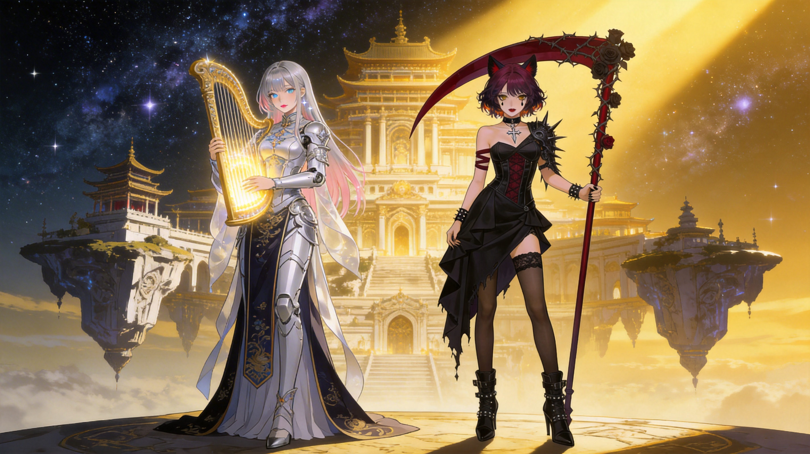
  
  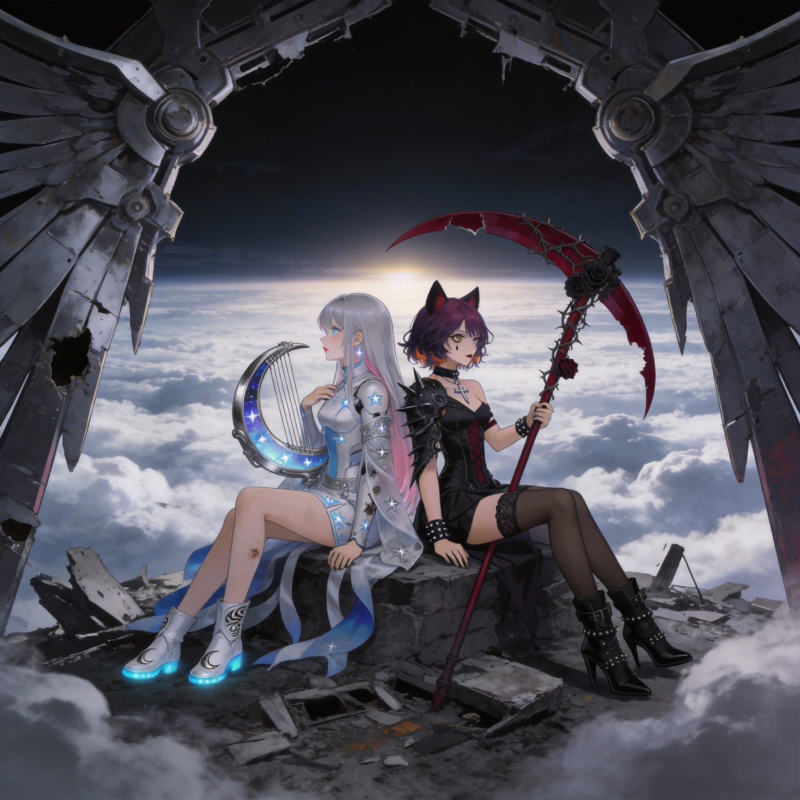
</p>

### 角色生成（Subject Reference）

将“身份 + 视觉符号 + 功能性装备 + 材质语言”绑定到同一套角色系统里：银蓝星辉与月弦乐器的清冷歌姬，与暗红荆棘镰刃的战斗歌姬形成强对比，便于在镜头语言中快速建立阵营与情绪张力。

<p align="center">
  
  
</p>

### 多视图生成（一致性辅助素材）

多视图不是“多角度截图”，而是为下游生产准备的约束器：同一套发型剪影、服装分件、道具比例与材质反射，被固定在可检索、可对照的版式里，显著降低后续分镜/关键帧阶段的人物漂移成本。

<p align="center">
  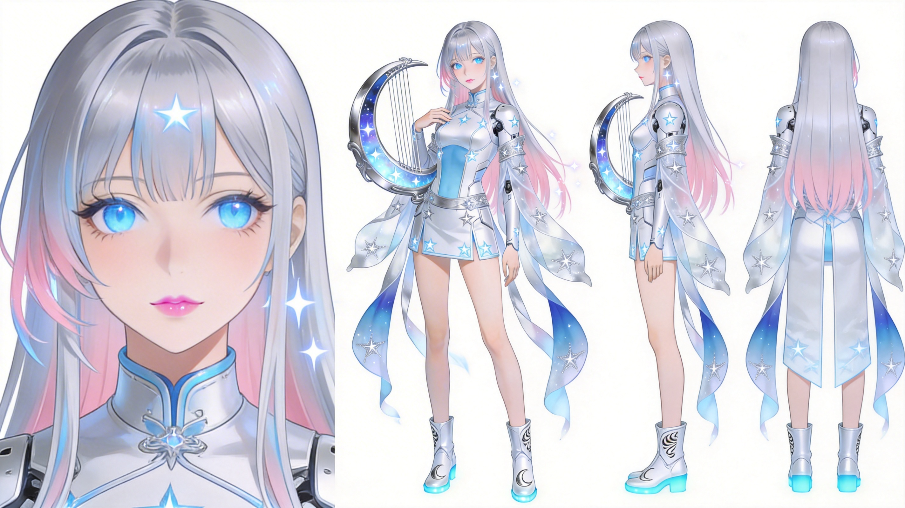
  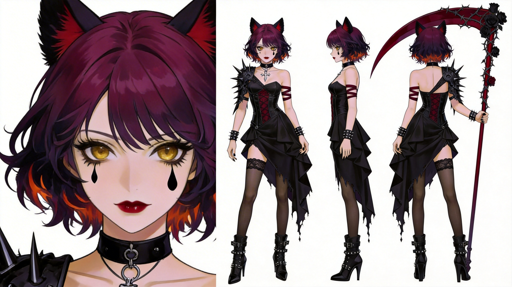
</p>

### 资产落盘与可复用设定

上述图片与设定会被自动落盘到 `output/projects/<项目名>/`，并与角色/场景/道具的设定文本、提示词、风格配置一起形成可追溯的“设计源文件”，便于团队协作与持续迭代：先锁定角色系统，再推进分镜与关键帧生产，最后进入视频合成。

## 架构设计概览

本项目的入口是 `purevis_agent.py`，其核心运行机制可以概括为以下五层：

1. **CLI 交互层**：基于 `rich` 渲染欢迎界面、状态动画、流式输出、工具调用面板与错误信息。
2. **会话执行层**：通过 `Runner(agent=orchestrator_agent, app_name="purevis_app", user_id="user_01")` 创建统一运行器，并初始化固定 `session_id`。
3. **命令解析层**：将输入分为两类：
   - 以 `/` 开头的本地管理命令，交给 `handle_cli_command(...)` 处理；
   - 普通自然语言请求，封装为 `Content(role="user", parts=[Part(text=...)])` 后送入总控智能体。
4. **多智能体调度层**：总控智能体根据任务阶段与工具边界，将任务转交给 `director`、`visual_director`、`image_gen`、`video_gen`、`vision_analyzer`。
5. **工具与状态层**：通过 `state_tools`、`style_tools`、`file_io`、`purevis`、`media_providers` 完成项目状态、风格配置、文件持久化、媒体生成与任务轮询。

## 核心执行流程

`purevis_agent.py` 的单轮请求处理流程如下：

1. 启动时优先加载 `.env`，确保模型与媒体提供方配置在 `veadk` 导入前生效。
2. 运行器尝试显式创建会话；若底层 API 不兼容，则忽略 `TypeError` 并通过一次 `runner.run("hello", ...)` 完成兜底初始化。
3. 每次收到自然语言请求前，先统计当前会话 `Token` 数；超过 `250000` 时自动触发历史压缩。
4. 通过 `runner.run_async(..., streaming_mode=StreamingMode.SSE)` 接收流式事件：
   - 非 `partial` 的 `function_call` 事件：展示工具调用或智能体转交信息；
   - 非 `partial` 的 `function_response` 事件：展示工具返回摘要；
   - `partial` 的文本事件：进行打字机式流式输出，并过滤函数调用构建片段。
5. 单轮回复结束后，输出当前上下文 `Token` 使用率，便于持续监控上下文成本。

# 安装

## 环境要求

- `Python 3.10+`
- 建议使用虚拟环境，例如 `venv` 或 `conda`
- 可访问对应的模型与媒体生成服务

## 创建虚拟环境并安装依赖

强烈建议使用虚拟环境隔离项目依赖。以下为基于 `venv` 的推荐安装方式：

```bash
python3 -m venv .venv

source .venv/bin/activate

pip install veadk-python google-genai python-dotenv rich tiktoken pillow requests
```

Windows 用户可使用以下命令激活环境：

```bash
.venv\Scripts\activate
```

如果项目后续提供 `requirements.txt`，也可以直接执行：

```bash
pip install -r requirements.txt
```

## 必须开通的模型服务

在使用本系统之前，您需要在 **火山引擎方舟平台 (`Volcengine Ark`)** 注册并开通以下能力，并获取对应 `API Key`：

<p align="left">
  
</p>

1. **文本生成模型**：用于剧本、分镜、调度与总结等文本任务。
   - 推荐：`doubao-seed-2-0-pro-260215`
2. **生图模型**：在使用火山底座作为媒体提供方时，用于 `Text-to-Image` 与 `Image-to-Image`。
   - 推荐：`doubao-seedream-4-5-251128`
3. **生视频模型**：在使用火山底座作为媒体提供方时，用于将关键帧转为短视频。
   - 推荐：`doubao-seedance-1-5-pro-251215`

> 如果没有配置 `PUREVIS_API_KEY`，系统会优先尝试回退到火山引擎方舟能力完成图片和视频生成。
>
> 如果您希望在文本侧引入不同风格或不同成本结构的模型，也可以将 Agent 或普通文本工具切换到 **Z.ai**：
>
> 
>
> 例如在 `.env` 中配置 `MODEL_TOOL_TEXT_NAME`、`MODEL_TOOL_TEXT_API_BASE`、`MODEL_TOOL_TEXT_API_KEY`，即可让文本策划、总结或部分工具链改由其他兼容模型提供方承接，而不影响整体工作流设计。

# 快速开始

## 初始化配置

项目根目录提供了配置模板 `.example_env`，建议按以下方式初始化：

```bash
cp .example_env .env
```

随后编辑 `.env`，填入您自己的配置项。请只填写占位值，不要将真实密钥提交到仓库。

## 启动系统

在项目根目录运行：

```bash
python purevis_agent.py
```

启动后，终端会展示带欢迎面板、状态动画与流式输出的交互式 CLI。您可以直接输入自然语言，由总控智能体自动解析意图并编排工作流。

## 典型使用示例

```text
我想创建一个新的短剧项目《赛博朋克2077》，帮我构思大纲。
```

```text
帮我设计女主角，20 岁赛博黑客，生成参考图存入主体库。
```

```text
新建第一集(ep01)，并根据大纲撰写剧本。
```

```text
请视觉导演介入，根据第一集剧本和主角参考图，设计 10 个关键帧的分镜。
```

```text
让生图智能体根据刚才的分镜提示词生成关键帧网格图，并让分析师检查光影。
```

```text
让视频智能体把第一集的所有关键帧生成 5 秒的动态视频。
```

# 功能

## 核心功能

下表基于 `purevis_agent.py`、`agents/` 与 `tools/` 目录的实际实现整理，列出当前智能体框架已支持的核心能力：

| 能力 | 一句话描述 | 输入格式 | 输出格式 | 典型使用场景 |
| --- | --- | --- | --- | --- |
| 多智能体编排 | 由 `orchestrator` 按制作阶段自动分派任务给专业子智能体 | 自然语言需求、项目名、阶段目标 | 分阶段执行结果、工具调用链、最终回复 | 从创意到成片的端到端统筹 |
| 项目建组与状态管理 | 在本地创建项目目录、记录配置、剧集、主体库与生成资产 | `project_name`、`settings`、`episode_id` | `state.json`、目录结构、状态摘要 | 新建项目、恢复项目、追踪进度 |
| 结构化风格治理 | 管理 `video`、`image`、`keyframe` 三类资产的风格配置与版本历史 | 项目名、风格家族、子类、目标媒介 | 风格配置快照、注入上下文、版本记录 | 统一视觉风格、切换或回滚风格 |
| 角色 / 场景 / 道具设定 | 调用设计工具生成文案描述与可用于后续生图的提示信息 | 角色/场景/道具名称、简介、风格、故事上下文 | 中文描述、生成提示词、设定文本 | 角色设定、空镜场景规划、道具设计 |
| 剧本拆解与分镜预处理 | 将剧本拆解为结构化分镜段落，为关键帧和视频提示词生成提供基础数据 | 剧本文本、`aspect_ratio`、风格、目标时长 | 分镜 `segments`、时间线结构 | 单集剧本生成后进入分镜阶段 |
| Exhausted JSON 分镜设计 | 将参考图或剧本扩展为连贯关键帧序列，并输出严格结构化 JSON | 参考图路径 / 剧本文本 / 项目状态 / 风格上下文 | 关键帧清单、逐帧 JSON、汇总 JSON | 视觉导演产出可直接下游消费的关键帧方案 |
| 文生图 / 图生图 | 使用提示词或参考图生成关键帧、参考图和概念图 | `prompt`、`aspect_ratio`、`input_images` | 异步 `task_id`、图片 URL、本地图片文件 | 角色参考图、场景图、关键帧生成 |
| 多视图 / 表情表 / 姿势表 | 基于角色参考图生成一致性辅助素材 | 角色名、参考图路径、提示词 | 单张 16:9 多视图拼图 / 多格图、本地图片文件 | 角色统一建模、动作与表情资产准备 |
| 图生视频 | 将 1 到 2 张关键帧或参考图转成动态视频片段 | 视频提示词、`input_images`、时长、画幅 | 异步 `task_id`、视频 URL、本地视频文件 | 从关键帧生成短剧片段、转场镜头 |
| 视觉分析与质检 | 异步分析图片并给出审美、一致性与重绘建议 | 图片 URL / 本地路径、`analyze_type` | 分析结果、修改建议、通过/打回结论 | 关键帧审核、角色一致性检查 |
| 资产持久化与本地预览 | 自动下载媒体、保存文本、注册主体图片并打开本地预览 | URL、保存路径、主体元信息 | 本地文件、可点击路径、主体库记录 | 落盘关键帧、预览角色图、管理项目素材 |
| 会话管理与 Token 压缩 | 支持查看历史、清空、导入导出、压缩上下文，控制长会话成本 | CLI 命令、历史文件路径 | Markdown 历史、压缩摘要、会话重建结果 | 长对话创作、恢复上下文、节省 Token |
| 工具链集成与提供方切换 | 在 `purevis`、`libtv`、`volcengine_ark`、`vidu`、`kling` 等提供方间按配置选择底层能力 | `.env`、`MEDIA_PROVIDER`、各类 API Key | 统一工具接口、自动回退或报错信息 | 根据环境选择媒体生成后端 |

## 智能体团队

本系统采用 `Multi-Agent` 架构，各司其职：

1. 🧠 **Orchestrator**：对接用户需求，按六大制作阶段调度各团队成员。
2. ✍️ **Director**：负责题材策划、角色/场景/道具设定、剧本撰写、剧本拆解与提示词预处理。
3. 🎬 **Visual Director**：负责将剧本或参考图转化为电影级关键帧序列，并输出穷尽式 `JSON` 分镜。
4. 🎨 **Image Gen**：负责文生图、图生图、多视图、表情表、姿势表及关键帧图片生成。
5. 🎥 **Video Gen**：负责将关键帧或参考图转化为最终视频片段。
6. 🧐 **Vision Analyzer**：负责视觉资产质检、审美把关和一致性分析。

## 六大制作阶段工作流

您可以随时询问当前阶段，也可以通过自然语言引导系统进入下一步。

### 阶段 1：题材策划与建组

**目标**：确定短剧类型、剧情大纲、世界观，并建立项目档案与基础配置。

> `我想创建一个新的短剧项目《赛博朋克2077》，帮我构思大纲。`

### 阶段 2：角色 / 场景设定

**目标**：设计角色、场景、道具的详细文案，并生成参考图录入主体库。

> `帮我设计女主角，20岁赛博黑客，生成参考图存入主体库。`

### 阶段 3：剧本创作

**目标**：创建剧集并撰写具体剧本。

> `新建第一集(ep01)，并根据大纲撰写剧本。`

### 阶段 4：图片分镜设计

**目标**：将剧本片段或参考图转化为连贯的电影级短镜头序列，并输出结构化 `JSON`。

> `请视觉导演介入，根据第一集剧本和主角参考图，设计10个关键帧的分镜。`

### 阶段 5：关键帧制作

**目标**：根据分镜设计批量生成图片资产，并由视觉分析师完成审核。

> `让生图智能体根据刚才的分镜提示词生成关键帧网格图，并让分析师检查光影。`

### 阶段 6：视频合成

**目标**：将关键帧转化为动态视频片段。

> `让视频智能体把第一集的所有关键帧生成 5 秒的动态视频。`

## 状态管理与资产持久化

系统会自动在根目录下创建 `output/` 文件夹，用于持久化保存生成的文本、图片、视频和项目状态。即使关闭终端，下次启动时只需告诉总控 `继续《某某项目》的工作`，系统即可读取 `state.json` 恢复进度。

目录结构示例：

```text
output/projects/<项目名>/
├── state.json
├── subjects/
│   ├── <角色名>/
│   └── <场景名>/
└── episodes/<剧集ID>/
    ├── scripts/
    ├── storyboard/
    ├── keyframes/
    └── videos/
```

## 基础生图与生视频能力展示

PureVis Studio Agent 底层集成了多模态生成模型，支持以下基础生成能力。您可以直接通过自然语言调度生图和生视频智能体完成相关任务。

### 文生图 (`Text-to-Image`)

通过自然语言描述，智能体能够从零开始生成高质量的图像资产，用于角色设定、场景概念图等。

**示例**：`山上有大象`


### 图生图 (`Image-to-Image`)

基于已有图像和提示词，智能体可以进行风格迁移、细节修改或角色替换等图生图操作。

**示例**：`骑象少女`


### 图生视频 (`Image-to-Video`)

智能体可以将静态图像转化为动态视频，支持基于单张图片生成动态效果，或提供首尾两帧进行平滑的过渡视频生成。

**示例**：`山上大象过渡到骑象少女`

<video width="720" controls preload="metadata" playsinline poster="demo/大象上的美女.jpg">
  <source src="https://github.com/susirial/purevis_ve_cli/raw/main/demo/%E5%B1%B1%E4%B8%8A%E5%A4%A7%E8%B1%A1%E8%BF%87%E6%B8%A1%E5%88%B0%E5%A4%A7%E8%B1%A1%E8%83%8C%E7%BE%8E%E5%A5%B3.mp4" type="video/mp4">
</video>

<table>
  <tr>
    <td width="220" valign="top">
      <a href="https://github.com/susirial/purevis_ve_cli/blob/main/demo/%E5%B1%B1%E4%B8%8A%E5%A4%A7%E8%B1%A1%E8%BF%87%E6%B8%A1%E5%88%B0%E5%A4%A7%E8%B1%A1%E8%83%8C%E7%BE%8E%E5%A5%B3.mp4">
        
      </a>
    </td>
    <td valign="top">
      支持视频控件的阅读器会直接显示可点击播放按钮；若当前平台不提供原生播放控件，可使用下方卡片跳转观看。<br/><br/>
      <strong>内容：</strong>山上大象过渡到骑象少女<br/>
      <strong>形式：</strong>GitHub README 兼容的视频访问卡片<br/>
      <strong>打开方式：</strong><a href="https://github.com/susirial/purevis_ve_cli/raw/main/demo/%E5%B1%B1%E4%B8%8A%E5%A4%A7%E8%B1%A1%E8%BF%87%E6%B8%A1%E5%88%B0%E5%A4%A7%E8%B1%A1%E8%83%8C%E7%BE%8E%E5%A5%B3.mp4">直接播放 MP4</a> · <a href="https://github.com/susirial/purevis_ve_cli/blob/main/demo/%E5%B1%B1%E4%B8%8A%E5%A4%A7%E8%B1%A1%E8%BF%87%E6%B8%A1%E5%88%B0%E5%A4%A7%E8%B1%A1%E8%83%8C%E7%BE%8E%E5%A5%B3.mp4">在 GitHub 中查看</a>
    </td>
  </tr>
</table>

## 完整案例：从一句需求到 15 秒宣传片

下面这组素材来自 `demo/完整演示/`，展示了 PureVis Studio Agent 如何把一句模糊的创意需求，逐步推进为 **剧本策划 -> 风格选择 -> 角色设定 -> 角色参考图 -> 图生视频提示词 -> 最终视频** 的完整闭环。这个案例对应项目名为 `短剧智能体宣传片`，目标是生成一个 15 秒、具有电影感和明显国风气质的智能体宣传视频。

### 一句话操作顺序

```text
1. 我们现在需要设计一个 15 秒视频，来宣传我们这个短剧创作智能体……
2. 我们选择 ## 风格 3：张艺谋 国风美学风格，给出角色设计提示词
3. 生成该角色的官方参考图
4. 脚本分镜已经有了，在 output/projects/短剧智能体宣传片/episodes/ep01/storyboard/张艺谋国风风格分镜.md，找视觉导演给出生视频提示词
5. 确认参数后，调用生视频工具生成视频
```

### 1. 用户先给出创作目标

用户并不是直接给一个“生视频提示词”，而是先提出一个带制作要求的自然语言需求：需要宣传短剧创作智能体、时长 15 秒、要有电影感、需要前景/中景/背景分层、镜头有远近变化，并希望系统先给出多个专业导演风格的脚本文案。

<p align="center">
  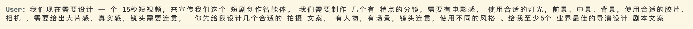
</p>

### 2. Orchestrator 判断任务阶段并召唤导演智能体

总控 `orchestrator` 会先理解这是一个“前期策划 + 宣传脚本 + 分镜设计”的需求，然后把任务转交给 `director`。这一步的价值在于：用户不需要自己判断该叫哪个 Agent，也不需要手动拆任务，系统会自动按职责边界完成调度。

<p align="center">
  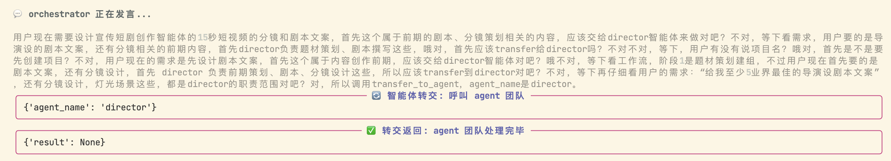
</p>

### 3. 导演智能体先产出宣传脚本，再拆成分镜，并给出 5 套风格方案

`director` 会先完成两件事：

1. 生成 15 秒宣传片脚本；
2. 把脚本拆成适合下游视觉导演继续处理的分镜结构。

在这个案例里，系统先给出 5 套不同导演气质的文案与分镜，并自动落盘到项目目录，便于后续复选与回看：

- `output/projects/短剧智能体宣传片/episodes/ep01/scripts/5种风格宣传脚本.md`
- `output/projects/短剧智能体宣传片/episodes/ep01/storyboard/诺兰风格分镜.md`
- `output/projects/短剧智能体宣传片/episodes/ep01/storyboard/是枝裕和治愈风格分镜.md`
- `output/projects/短剧智能体宣传片/episodes/ep01/storyboard/韦斯安德森风格分镜.md`
- `output/projects/短剧智能体宣传片/episodes/ep01/storyboard/扎克施耐德风格分镜.md`
- `output/projects/短剧智能体宣传片/episodes/ep01/storyboard/张艺谋国风风格分镜.md`

<p align="center">
  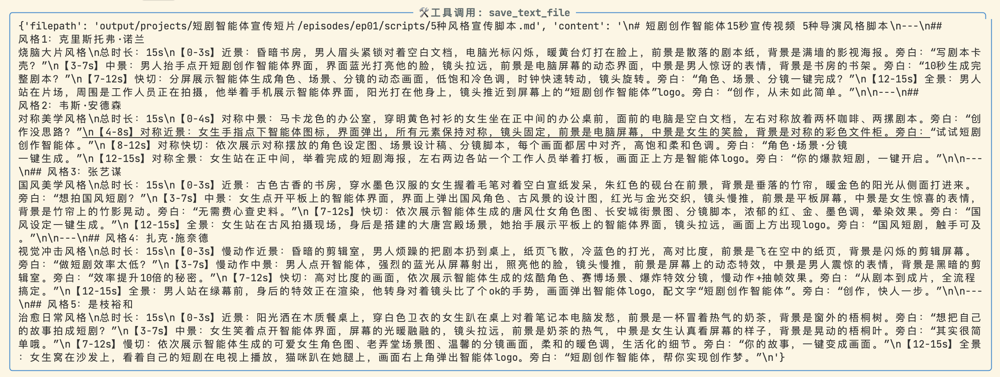
</p>

<p align="center">
  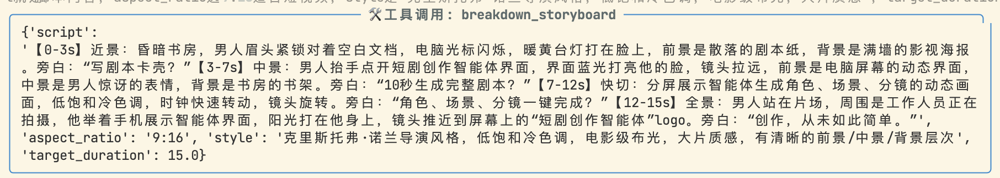
</p>

<p align="center">
  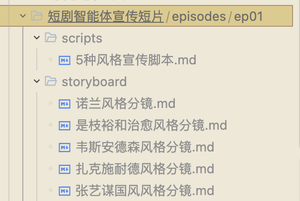
</p>

其中，案例里最终选择的是 `风格 3：张艺谋国风美学风格`。这一版强调：

- 朱砂红、赤金、墨黑的高对比国风色板；
- 大片感构图与明显的景深层次；
- 丝绸、宣纸、水墨、宫殿等具象视觉符号；
- 更适合做“智能体宣传片”的庄重、东方、仪式化表达。

<p align="center">
  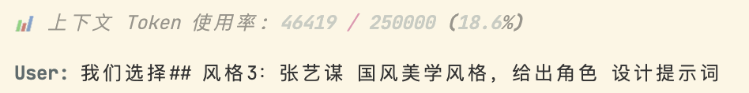
</p>

### 4. 基于选定风格，导演继续产出角色设定文案

风格确定后，用户继续让 `director` 进入角色设计阶段。系统调用 `design_character`，输入了明确的角色身份、年龄、气质、服饰和风格约束，例如：

```text
角色名：国风创作者-林晓
角色简介：20 岁左右年轻女性，齐肩柔顺黑发，气质温婉书卷气
风格：张艺谋国风美学风格，浓郁红金墨配色，大光比火光，35mm 胶片颗粒
故事上下文：古色古香书房中使用短剧创作智能体生成国风短剧设定，最终站在大唐宫殿拍摄现场展示创作成果
```

<p align="center">
  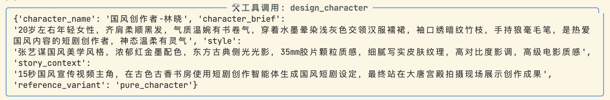
</p>

角色设定会自动保存到主体目录，例如：

- `output/projects/短剧智能体宣传片/subjects/国风创作者林晓_角色设定.md`

文档中既包含可直接复用的英文生图提示词，也包含中文人物设定说明，适合继续流转到参考图生成、多视图生成、关键帧生成等后续环节。

<p align="center">
  
</p>

<p align="center">
  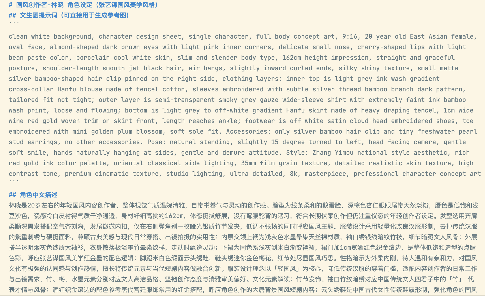
</p>

### 5. 用户要求生成角色参考图，系统调用 LibTV `lib_nano_2`

有了角色设定文案后，用户继续说一句自然语言：`生成该角色的官方参考图`。此时系统会自动把前一步产出的设定文案转成标准化的参考图提示词，并调用底层生图工具。

这个案例中，实际路由如下：

- provider：`libtv`
- model：`lib_nano_2`
- capability：`generate_reference_image`
- aspect_ratio：`9:16`

这说明 README 前文提到的“文本设计层与媒体生成层解耦”在真实工作流里是可落地的：上游由 `director` 负责语义设计，下游由媒体 provider 负责具体出图。

<p align="center">
  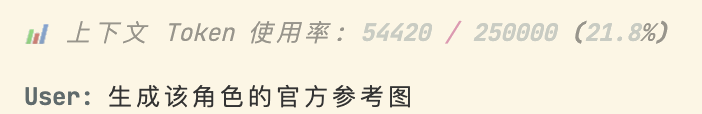
</p>

<p align="center">
  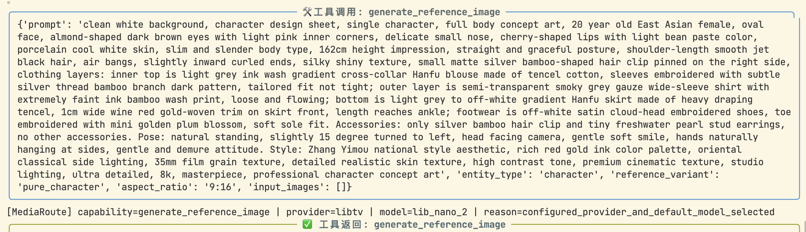
</p>

生成结果如下。可以看到，它并不是简单的人像图，而是带材质细节、服装拆解、局部放大和色板的“角色设计参考图”，更适合直接进入后续生产。

<p align="center">
  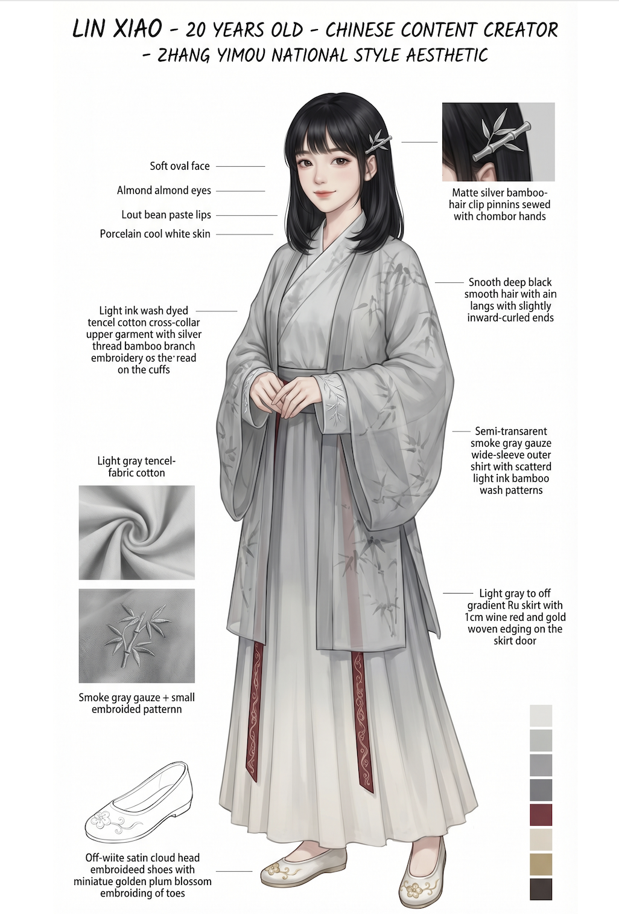
</p>

如果需要进一步约束人物一致性，还可以继续生成多视图。这样在后续分镜、关键帧和视频阶段，角色就更不容易漂移。

<p align="center">
  
</p>

### 6. 分镜已有后，交给视觉导演审阅并生成图生视频提示词

当剧本和分镜文件已经存在时，用户不必重新描述镜头，只要把分镜路径告诉系统即可。这个案例里，用户直接引用已保存的分镜文件，请视觉导演审查并生成视频提示词：

```text
脚本分镜已经有了，在
output/projects/短剧智能体宣传片/episodes/ep01/storyboard/张艺谋国风风格分镜.md，
你需要审查一下，找视觉导演给出生视频提示词
```

<p align="center">
  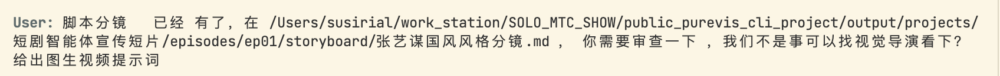
</p>

视觉导演给出的不是一句模糊描述，而是一张“视频生成确认卡”，其中会明确：

- 镜头语言：近景、中景、大全景、推近、平移、俯拍等；
- 时间结构：`S01-S06` 每段持续时间与转场关系；
- 参考图输入：角色主体图或多视图图；
- 视频参数：`duration`、`aspect_ratio`、`model`、是否带音频；
- 旁白与环境声建议。

这一步特别关键，因为它把“剧本文案”转成了“生视频模型可消费的提示词与参数结构”。

<p align="center">
  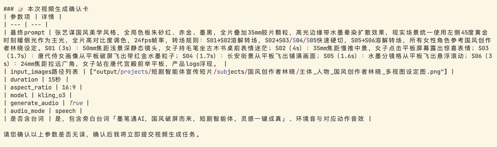
</p>

### 7. 参数确认后，调用生视频工具生成最终宣传片

确认完成后，系统正式调用 `generate_video`。在这次实际生成中，使用的是：

- provider：由当前媒体路由自动选择
- model：`seedance_2_0_fast`
- duration：`15`
- aspect_ratio：`16:9`
- input_images：`output/projects/短剧智能体宣传片/subjects/国风创作者林晓/主体-人物_国风创作者林晓_多视图设定图.png`

也就是说，前面生成的角色参考资产和分镜文件，并不会停留在“展示层”，而会真实进入下游视频生产。

<p align="center">
  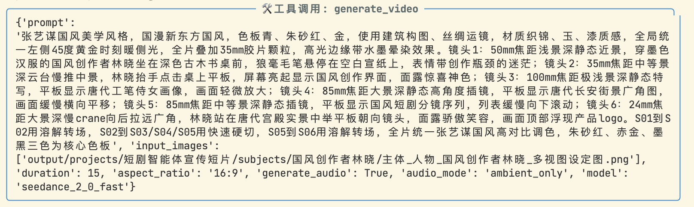
</p>

> 上一步的“确认卡”展示了一个可调整的参数版本；在真正提交生成前，模型、音频模式等参数仍可按当前 provider 能力或用户意图做最终确认。因此你可以把这一步理解为“人可读确认层”，而 `generate_video` 则是最终执行层。

最终生成的视频如下。若当前平台不直接内嵌播放，可点击封面图或 MP4 链接查看：

<video width="720" controls preload="metadata" playsinline poster="demo/完整演示/1-11-角色参考图.png">
  <source src="demo/完整演示/1-15-生成的视频.mp4" type="video/mp4">
</video>

<table>
  <tr>
    <td width="220" valign="top">
      <a href="demo/完整演示/1-15-生成的视频.mp4">
        
      </a>
    </td>
    <td valign="top">
      <strong>项目：</strong>短剧智能体宣传片<br/>
      <strong>风格：</strong>张艺谋国风美学<br/>
      <strong>时长：</strong>15 秒<br/>
      <strong>关键价值：</strong>从自然语言需求直接推进到脚本、角色资产、图生视频提示词与最终视频<br/>
      <strong>查看方式：</strong><a href="demo/完整演示/1-15-生成的视频.mp4">直接打开 MP4</a>
    </td>
  </tr>
</table>

### 这个案例说明了什么

这个完整演示说明，PureVis Studio Agent 的价值并不只是“能调一个生图模型”或“能调一个生视频模型”，而是把整个创作过程工程化了：

- 用户只需要表达目标，不必自己拆分脚本、分镜、角色设定、提示词和工具调用；
- `orchestrator` 自动判断阶段并召唤合适的专业 Agent；
- `director` 和 `visual_director` 把抽象需求逐步转成可执行的结构化资产；
- 角色文案、参考图、多视图、分镜文件都会自动落盘，可追溯、可复用；
- 底层媒体 provider 可以切换，但上层创作工作流保持一致。

# 命令

## 命令解析机制

系统当前支持两类命令入口：

1. **本地 CLI 管理命令**：以 `/` 开头，由 `handle_cli_command(...)` 直接解析，不进入大模型推理。
2. **自然语言创作命令**：不以 `/` 开头，进入总控智能体，由其决定是否调用工具、是否转交子智能体、是否等待异步媒体任务完成。

命令处理规则如下：

- 输入 `exit` 或 `quit` 时，程序直接安全退出。
- 输入空白内容时，当前轮对话被忽略。
- 输入 `/...` 时，执行本地命令，例如历史管理、风格管理、导入导出、清理 `output` 等。
- 输入自然语言时，由 `orchestrator` 识别当前制作阶段，并按职责边界分派给对应子智能体。

## 命令总览

### 数据查询类

| 命令原型 | 必填参数 | 选填参数 | 使用示例 | 返回结果说明 |
| --- | --- | --- | --- | --- |
| `/history` | 无 | 无 | `/history` | 以 `Markdown` 形式打印当前会话历史，包括用户消息、模型文本、工具调用与工具返回摘要 |
| `/style families` | 无 | 无 | `/style families` | 返回一级风格家族列表、中文名称、子类数量 |
| `/style subtypes <family>` | `family` | 无 | `/style subtypes cinematic` | 返回某风格家族下的可选子类、适配媒介与推荐色板 |
| `/style show <family> <subtype>` | `family`、`subtype` | 无 | `/style show cinematic neo_noir` | 返回风格预设详情，包括推荐镜头、材质、受众标签等 |
| `/style current <project>` | `project` | 无 | `/style current 赛博朋克2077` | 返回项目当前风格配置 `JSON` |
| `/style versions <project>` | `project` | 无 | `/style versions 赛博朋克2077` | 返回最近版本变更记录，便于追溯风格调整历史 |
| `列出当前已有项目` | 无 | 无 | `现在有哪些项目？` | 总控调用项目状态工具，返回项目列表与可恢复项目提示 |
| `查看项目状态` | `project_name` | 无 | `查看《赛博朋克2077》的当前状态和已有角色` | 总控返回项目配置、剧集、主体库与阶段进展摘要 |

### 可视化类

| 命令原型 | 必填参数 | 选填参数 | 使用示例 | 返回结果说明 |
| --- | --- | --- | --- | --- |
| `角色/场景参考图生成` | 角色或场景描述 | 项目名、风格、参考图路径 | `帮我设计女主角，20岁赛博黑客，生成参考图存入主体库。` | 触发设定工具与生图工具，返回图片结果、本地保存路径、主体库注册信息 |
| `剧本分镜设计` | 剧本或参考图 | 项目名、关键帧数量、风格目标 | `请视觉导演介入，根据第一集剧本和主角参考图，设计10个关键帧的分镜。` | 返回关键帧解析、逐帧 `Exhausted JSON` 与可落盘的分镜文档 |
| `关键帧图片生成` | 分镜提示词或分镜 JSON | 参考图、本地路径、画幅 | `让生图智能体根据刚才的分镜提示词生成关键帧网格图。` | 返回异步任务完成后的图片 URL、本地文件路径与预览结果 |
| `视频合成` | 提示词、关键帧图片 | `duration`、`aspect_ratio`、是否生成音频 | `让视频智能体把第一集的所有关键帧生成 5 秒的动态视频。` | 返回异步任务完成后的本地视频文件路径与生成状态 |
| `项目资产画廊` | `project_name` | 无 | `打开《赛博朋克2077》的项目资产仪表盘。` | 生成并打开 `HTML` 资产画廊，直观查看当前项目图片资产 |
| `视觉审核` | 图片路径或图片 URL | `analyze_type` | `检查刚生成的关键帧是否符合赛博朋克夜景氛围。` | 返回审美、一致性、光影与重绘建议，并给出通过/重做判断 |

### 系统管理类

| 命令原型 | 必填参数 | 选填参数 | 使用示例 | 返回结果说明 |
| --- | --- | --- | --- | --- |
| `/help` | 无 | 无 | `/help` | 返回所有本地 CLI 命令与说明 |
| `/clear` | 无 | 无 | `/clear` | 删除并重建当前会话，清空模型短期记忆 |
| `/compact` | 无 | 无 | `/compact` | 调用总结器压缩会话历史，输出压缩前后 `Token` 数 |
| `/export` | 无 | 无 | `/export` | 将当前会话导出为 `Markdown`，写入 `output/chat_history_<timestamp>.md` |
| `/import <filepath>` | `filepath` | 无 | `/import output/chat_history_20260411_120000.md` | 读取指定文件并作为历史摘要注入当前会话 |
| `/delete` | 无 | 无 | `/delete` | 先扫描并预览 `output/` 目录内容，不立即删除 |
| `/delete confirm` | 无 | 无 | `/delete confirm` | 真正清空 `output/` 下的顶层内容，但保留 `output/` 目录本身 |
| `/style apply <project> <target> <family> <subtype>` | `project`、`target`、`family`、`subtype` | 无 | `/style apply 赛博朋克2077 image cinematic neo_noir` | 更新指定项目在 `video` / `image` / `keyframe` 目标上的风格配置 |
| `/style delete <project> [target]` | `project` | `target` | `/style delete 赛博朋克2077 image` | 删除某个目标或全部风格配置 |
| `exit` / `quit` | 无 | 无 | `quit` | 安全退出交互式程序 |

## 工具调用流程

自然语言请求进入系统后，通常遵循以下链路：

1. `orchestrator` 识别当前制作阶段与任务边界。
2. 若涉及项目信息、风格上下文或主体库检索，先调用 `state_tools` / `style_tools`。
3. 若涉及内容设计，由 `director` 或 `visual_director` 产出文本设定、分镜拆解或 `JSON` 提示词。
4. 若涉及媒体生成，由 `image_gen` 或 `video_gen` 提交异步任务。
5. 异步任务提交后，智能体优先调用 `wait_for_task(...)` 阻塞等待，不建议在对话中频繁手动轮询。
6. 任务完成后，使用 `download_and_save_media(...)` 落盘，并在需要时调用本地预览或注册到主体库。
7. 若涉及审查，则由 `vision_analyzer` 调用 `analyze_image(...)` 获取分析结果并输出修改建议。

## 错误处理与恢复策略

系统在入口层和工具层都加入了较明确的错误处理策略：

- **会话初始化兜底**：显式创建会话失败时，会忽略兼容性 `TypeError`，并通过一次 `hello` 调用触发内部状态初始化。
- **超长上下文保护**：会话超过 `250000` `Token` 时自动调用压缩逻辑，防止长会话失控。
- **流式输出去重**：只对 `partial` 文本事件做实时输出，避免非 `partial` 聚合结果重复打印。
- **工具输出截断**：工具返回结果过长时仅展示前 `250` 个字符，降低终端噪声。
- **安全删除保护**：`/delete` 只允许清理当前工作目录下名为 `output` 的目录，且要求二次确认。
- **目录安全校验**：若 `output` 目录为符号链接、非目录，或路径越界，会直接拒绝操作。
- **导入导出校验**：`/import` 会检查文件存在性与可读性，`/export` 会先校验 `output` 目录是否安全。
- **统一异常捕获**：主循环对单轮请求包裹 `try/except`，出现异常时停止状态动画并打印错误信息，避免 CLI 卡死。

# 配置

## 环境变量说明

根目录下的 `.example_env` 已给出推荐配置项。常用变量如下：

| 变量名 | 是否必填 | 说明 |
| --- | --- | --- |
| `MODEL_AGENT_PROVIDER` | 否 | VeADK Agent 模型提供商，默认推荐 `openai` |
| `MODEL_AGENT_NAME` | 是 | Agent 主文本模型名称，用于对话、调度、写剧本、总结等 |
| `MODEL_AGENT_API_BASE` | 否 | Agent 主文本模型访问地址 |
| `MODEL_AGENT_API_KEY` | 是 | Agent 主文本模型的 `API Key` |
| `MODEL_AGENT_EXTRA_CONFIG` | 否 | VeADK Agent 模型额外参数，要求为 JSON 对象字符串 |
| `MODEL_TOOL_TEXT_NAME` | 否 | 普通文本工具模型名称；未配置时默认继承 `MODEL_AGENT_NAME` |
| `MODEL_TOOL_TEXT_API_BASE` | 否 | 普通文本工具访问地址；未配置时默认继承 `MODEL_AGENT_API_BASE` |
| `MODEL_TOOL_TEXT_API_KEY` | 否 | 普通文本工具 `API Key`；未配置时默认继承 `MODEL_AGENT_API_KEY` |
| `MODEL_TOOL_VISION_ANALYZER_NAME` | 否 | 图片分析工具模型名称，推荐固定为 `doubao-seed-2-0-pro-260215` |
| `MODEL_TOOL_VISION_ANALYZER_API_BASE` | 否 | 图片分析工具访问地址，推荐固定为火山方舟 `api/v3` |
| `MODEL_TOOL_VISION_ANALYZER_API_KEY` | 否 | 图片分析工具 `API Key`；推荐与媒体生成共用火山方舟凭证 |
| `VOLCENGINE_ARK_API_KEY` | 否 | 火山方舟媒体生成专用 `API Key`，用于生图和生视频，推荐显式配置 |
| `VOLCENGINE_ARK_API_BASE` | 否 | 火山方舟媒体生成专用访问地址，默认 `https://ark.cn-beijing.volces.com/api/v3/` |
| `PUREVIS_API_KEY` | 否 | `PureVis` 高级媒体工作流密钥；配置后可优先使用 `purevis` 作为底层提供方 |
| `LIBTV_ACCESS_KEY` | 否 | `LibTV` 媒体生成密钥；配置后可启用 `libtv` 作为底层媒体提供方 |
| `MEDIA_PROVIDER` | 否 | 显式指定全局默认媒体提供方，可选 `auto`、`purevis`、`libtv`、`volcengine_ark`、`vidu`、`kling` |
| `MEDIA_IMAGE_PROVIDER` | 否 | 显式指定生图默认媒体提供方；留空时回退到 `MEDIA_PROVIDER` |
| `MEDIA_VIDEO_PROVIDER` | 否 | 显式指定生视频默认媒体提供方；留空时回退到 `MEDIA_PROVIDER` |
| `MEDIA_IMAGE_DEFAULT_MODEL` | 否 | 显式指定生图默认模型；仅在目标 provider 支持显式模型切换时生效 |
| `MEDIA_VIDEO_DEFAULT_MODEL` | 否 | 显式指定生视频默认模型；仅在目标 provider 支持显式模型切换时生效 |
| `LOGGING_LEVEL` | 否 | 运行日志等级，例如 `ERROR` |
| `VOLCENGINE_ACCESS_KEY` | 否 | 火山引擎内置工具预留 `AK` |
| `VOLCENGINE_SECRET_KEY` | 否 | 火山引擎内置工具预留 `SK` |

## LibTV 支持

当前项目已显式增加 `LibTV` 作为底层媒体提供方，并支持通过能力级配置将“生图”和“生视频”分别路由到不同默认 provider。

当你设置：

```bash
MEDIA_PROVIDER=libtv
LIBTV_ACCESS_KEY=<your_libtv_access_key>
```

系统会使用 `LibTV` 作为媒体生成后端。

如果你希望生图和生视频都默认走 `LibTV`，并且进一步锁定默认模型，也可以这样配置：

```bash
MEDIA_PROVIDER=auto
MEDIA_IMAGE_PROVIDER=libtv
MEDIA_VIDEO_PROVIDER=libtv
MEDIA_IMAGE_DEFAULT_MODEL=lib_nano_2
MEDIA_VIDEO_DEFAULT_MODEL=seedance_2_0_fast
LIBTV_ACCESS_KEY=<your_libtv_access_key>
```

当前已支持的 `LibTV` 模型如下：

- 生图模型：
  - `lib_nano_2`
  - `lib_nano_pro`
- 生视频模型：
  - `seedance_2_0`
  - `seedance_2_0_fast`
  - `kling_o3`

建议理解方式如下：

- `lib_nano_2`：更快、成本更低，适合作为默认生图模型
- `lib_nano_pro`：更强的生图质量，适合定稿与高质量输出
- `seedance_2_0`：质量优先的视频模型
- `seedance_2_0_fast`：时延优先的视频模型
- `kling_o3`：LibTV 支持的视频模型通道之一

当前代码中已接入的 `LibTV` 能力包括：

- `generate_image`
- `generate_video`
- `query_task_status`
- `generate_reference_image`
- `generate_multi_view`
- `generate_prop_three_view_sheet`
- `generate_storyboard_grid_sheet`

## `.env` 示例

以下示例表示“Agent 与普通文本工具可切换，图片分析固定为 doubao，媒体生成显式绑定 LibTV”的推荐配置方式。请使用您自己的密钥占位值，不要将真实 `API Key`、`AK`、`SK` 写入文档或仓库：

```bash
MODEL_AGENT_PROVIDER=openai
MODEL_AGENT_NAME=doubao-seed-2-0-pro-260215
MODEL_AGENT_API_BASE=https://ark.cn-beijing.volces.com/api/v3/
MODEL_AGENT_API_KEY=<your_ark_api_key>
MODEL_AGENT_EXTRA_CONFIG=

# 普通文本工具默认继承 MODEL_AGENT_*，只有在需要单独切换时才配置
# MODEL_TOOL_TEXT_PROVIDER=openai
# MODEL_TOOL_TEXT_NAME=glm-5.1
# MODEL_TOOL_TEXT_API_BASE=https://api.z.ai/api/paas/v4/
# MODEL_TOOL_TEXT_API_KEY=<your_zai_api_key>

MODEL_TOOL_VISION_ANALYZER_PROVIDER=openai
MODEL_TOOL_VISION_ANALYZER_NAME=doubao-seed-2-0-pro-260215
MODEL_TOOL_VISION_ANALYZER_API_BASE=https://ark.cn-beijing.volces.com/api/v3/
MODEL_TOOL_VISION_ANALYZER_API_KEY=<your_ark_api_key>

VOLCENGINE_ARK_API_BASE=https://ark.cn-beijing.volces.com/api/v3/
VOLCENGINE_ARK_API_KEY=<your_ark_api_key>

LOGGING_LEVEL=ERROR

PUREVIS_API_KEY=
LIBTV_ACCESS_KEY=<your_libtv_access_key>

MEDIA_PROVIDER=auto
MEDIA_IMAGE_PROVIDER=libtv
MEDIA_VIDEO_PROVIDER=libtv
MEDIA_IMAGE_DEFAULT_MODEL=lib_nano_2
MEDIA_VIDEO_DEFAULT_MODEL=seedance_2_0_fast
```

> 火山引擎内置工具（如 `web_search`）所需的 `AK/SK` 当前在本项目中仍属于预留配置，默认不需要填写；只有未来接入相关内置工具时才需要补充。

## Agent 显式模型配置策略

当前项目已改为“显式 Agent 模型配置版”：

1. 每个 Agent 在构造时都会显式传入 `model_name`、`model_provider`、`model_api_base` 等参数。
2. 这些参数统一从 `.env` 读取，而不是完全依赖 VeADK 的隐式默认配置。
3. 默认先读取全局变量，再读取按 Agent 细分的覆盖变量。
4. 工具层文本模型与图片分析模型已与 Agent 层拆分治理。

全局默认变量如下：

- `MODEL_AGENT_PROVIDER`
- `MODEL_AGENT_NAME`
- `MODEL_AGENT_API_BASE`
- `MODEL_AGENT_API_KEY`
- `MODEL_AGENT_EXTRA_CONFIG`

如需对单个 Agent 单独覆盖，可使用以下命名规则：

- `MODEL_<AGENT_NAME>_PROVIDER`
- `MODEL_<AGENT_NAME>_NAME`
- `MODEL_<AGENT_NAME>_API_BASE`
- `MODEL_<AGENT_NAME>_API_KEY`
- `MODEL_<AGENT_NAME>_EXTRA_CONFIG`

其中 `<AGENT_NAME>` 使用大写形式，当前支持：

- `ORCHESTRATOR`
- `DIRECTOR`
- `VISUAL_DIRECTOR`
- `IMAGE_GEN`
- `VIDEO_GEN`
- `VISION_ANALYZER`

优先级如下：

1. 单 Agent 覆盖变量
2. 全局 `MODEL_AGENT_*`
3. 项目内置默认值

## 工具层模型配置策略

为避免 Agent 主模型切换后工具层仍然停留在旧模型，本项目将工具层拆为两类：

1. **普通文本工具**：角色/场景/道具设计、分镜拆解、关键帧提示词、视频提示词生成
2. **图片分析工具**：`analyze_image`

普通文本工具使用以下变量：

- `MODEL_TOOL_TEXT_PROVIDER`
- `MODEL_TOOL_TEXT_NAME`
- `MODEL_TOOL_TEXT_API_BASE`
- `MODEL_TOOL_TEXT_API_KEY`
- `MODEL_TOOL_TEXT_EXTRA_CONFIG`
- `MODEL_TOOL_TEXT_TEMPERATURE_DEFAULT`
- `MODEL_TOOL_DESIGN_CHARACTER_TEMPERATURE`
- `MODEL_TOOL_DESIGN_SCENE_TEMPERATURE`
- `MODEL_TOOL_DESIGN_PROP_TEMPERATURE`
- `MODEL_TOOL_BREAKDOWN_STORYBOARD_TEMPERATURE`
- `MODEL_TOOL_GENERATE_KEYFRAME_PROMPTS_TEMPERATURE`
- `MODEL_TOOL_GENERATE_VIDEO_PROMPTS_TEMPERATURE`

其优先级如下：

1. `MODEL_TOOL_TEXT_*`
2. `MODEL_AGENT_*`
3. 项目内置默认值

这意味着当你把系统主文本模型从 `doubao-seed-2-0-pro-260215` 切到 `glm-5.1` 时，普通文本工具会默认跟随切换。

图片分析工具使用以下变量：

- `MODEL_TOOL_VISION_ANALYZER_PROVIDER`
- `MODEL_TOOL_VISION_ANALYZER_NAME`
- `MODEL_TOOL_VISION_ANALYZER_API_BASE`
- `MODEL_TOOL_VISION_ANALYZER_API_KEY`
- `MODEL_TOOL_VISION_ANALYZER_EXTRA_CONFIG`
- `MODEL_TOOL_VISION_ANALYZER_TEMPERATURE`

其设计原则是：

1. 默认固定为 `doubao-seed-2-0-pro-260215`
2. 不继承 `MODEL_AGENT_*`
3. 与普通文本工具分开治理，避免全局切换影响视觉分析稳定性

### 推荐的 temperature 分层

当前项目不再建议统一写死 `temperature=0.7`，而是按任务类型分层：

- 角色设计：`0.75`
- 场景设计：`0.65`
- 道具设计：`0.60`
- 分镜拆解：`0.40`
- 关键帧提示词：`0.45`
- 视频提示词：`0.45`
- 图片分析：`0.15`

推荐原因：

- 创意设计类任务需要更高的发散度
- 结构化生成类任务需要平衡创造性与约束性
- 图片分析类任务更强调稳定和可重复，不适合高温度

## 媒体提供方选择逻辑

底层媒体提供方的选择逻辑如下：

1. 如果显式设置了 `MEDIA_IMAGE_PROVIDER` 或 `MEDIA_VIDEO_PROVIDER`，系统会优先将对应能力路由到该 provider。
2. 如果未设置能力级 provider，则回退到 `MEDIA_PROVIDER`。
3. 如果 `MEDIA_PROVIDER=auto` 且存在 `PUREVIS_API_KEY`，优先使用 `purevis`。
4. 如果 `MEDIA_PROVIDER=auto` 且不存在 `PUREVIS_API_KEY`，但存在 `LIBTV_ACCESS_KEY`，则回退到 `libtv`。
5. 如果 `MEDIA_PROVIDER=auto` 且不存在 `PUREVIS_API_KEY` 与 `LIBTV_ACCESS_KEY`，但存在 `VOLCENGINE_ARK_API_KEY`，则回退到 `volcengine_ark`。
6. 如果既没有可用的 `PUREVIS_API_KEY`、`LIBTV_ACCESS_KEY`，也没有可用的 `VOLCENGINE_ARK_API_KEY`，系统会继续兼容检查 `MODEL_TOOL_VISION_ANALYZER_API_KEY` 与 `MODEL_AGENT_API_KEY`。
7. 如果仍然没有可用凭证，媒体相关能力会报错并提示缺少可用服务。

默认模型的选择逻辑如下：

1. 如果用户在本次调用中显式指定 `model`，系统始终优先尊重该模型。
2. 如果未显式指定模型，且设置了 `MEDIA_IMAGE_DEFAULT_MODEL` 或 `MEDIA_VIDEO_DEFAULT_MODEL`，系统会优先尝试使用对应默认模型。
3. 只有当目标 provider 支持显式模型切换，且该默认模型与 provider 能力兼容时，能力级默认模型才会生效。
4. 如果默认模型与目标 provider 不兼容，系统会直接报配置错误，而不会静默替换模型。
5. 如果未设置能力级默认模型，则回退到 provider 自身的默认模型策略。

# FAQ

## 常见问题

- **为什么输入自然语言也能触发这么多工具？**  
  因为系统会先把自然语言交给总控智能体解析，再由总控根据当前阶段自动调度子智能体和工具。

- **为什么 `/delete` 不会立即删除文件？**  
  这是刻意设计的安全策略。系统会先扫描 `output/` 目录，展示路径、文件数、体积和预览列表，只有执行 `/delete confirm` 才会真正删除。

- **为什么有时会自动压缩历史会话？**  
  当当前会话估算超过 `250000` `Token` 时，系统会自动调用总结器，将旧历史压缩为摘要，以避免上下文过长影响稳定性。

- **为什么没有配置 `PUREVIS_API_KEY` 也可能继续生图或生视频？**  
  因为项目支持媒体提供方回退逻辑。在没有 `PUREVIS_API_KEY` 时，如果配置了 `LIBTV_ACCESS_KEY`，系统会优先尝试使用 `libtv`；如果也没有 `LIBTV_ACCESS_KEY`，但配置了 `VOLCENGINE_ARK_API_KEY`，系统会继续回退到 `volcengine_ark`；兼容场景下也会检查 `MODEL_TOOL_VISION_ANALYZER_API_KEY` 与 `MODEL_AGENT_API_KEY`。

- **目前有哪些已知限制？**  
  当前入口程序使用固定的 `user_id` 和 `session_id`，更适合本地单用户连续创作；`video_gen` 的 `input_images` 最多支持 `2` 张；剧集编号必须使用 `ep01`、`ep02` 这类格式；`breakdown_storyboard`、`generate_keyframe_prompts`、`generate_video_prompts` 需要实质性的剧本或分镜内容，传入空结构可能触发 `INTENT_REJECTED` 或生成失败。
